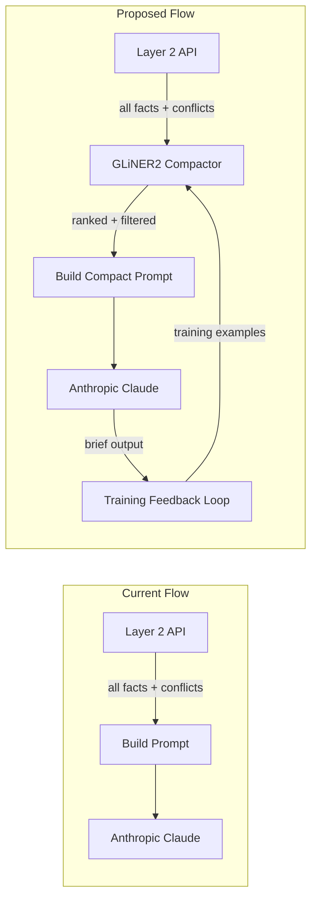

# GLiNER2 Context Compaction for VCbrain Harness

## Problem

Today, [`vcbrain_harness/harness.py`](vcbrain_harness/harness.py) sends **every** fact and **every** open conflict for a company to Anthropic in a single user message. For data-rich entities (e.g. `customer_signals.json` has 148K+ lines), this generates large prompts with significant token cost. There is no filtering, ranking, or compression of facts before they reach Claude.

## Architecture



## Key Design Decisions

- **GLiNER2 via Pioneer.ai API** (`GLiNER2.from_api()`) using the `PIONEER_API_KEY` from [`.env`](.env). This gives access to the largest GLiNER XL 1B model without GPU requirements.
- **Two GLiNER2 tasks used in tandem:**
  1. `extract_entities` -- identify and tag investment-critical entities (company metrics, people, financial figures, deal terms) with confidence scores
  2. `classify_text` -- classify each fact line as `critical` / `useful` / `supplementary` for investment decisions
- Facts classified as `supplementary` with low GLiNER confidence are dropped; `critical` facts are always kept; `useful` facts are kept up to a configurable token budget.
- **Continuous training** uses the Anthropic brief output as weak supervision: after each `solve()` call, the facts that appeared in Claude's `key_facts` response are treated as positive examples for the `critical` label.

## Implementation

### 1. New module: `vcbrain_harness/compactor.py`

This module encapsulates all GLiNER2 interaction:

```python
from gliner2 import GLiNER2

ENTITY_LABELS = {
    "financial_metric": "Revenue, ARR, MRR, valuation, funding amounts",
    "company_stage": "Seed, Series A/B/C, growth stage, IPO",
    "deal_status": "Pipeline, accepted, rejected, POC status",
    "red_flag": "Declining revenue, fraud signal, regulatory issue",
    "key_person": "CEO, founder, board member, investor name",
}

RELEVANCE_LABELS = ["critical", "useful", "supplementary"]
```

Key functions:
- `compact_facts(facts: list[dict], company_name: str) -> list[dict]` -- runs GLiNER2 entity extraction + classification on each fact's text representation, returns only facts above the relevance threshold, sorted by confidence
- `compact_conflicts(conflicts: list[dict]) -> list[dict]` -- classifies conflicts by severity, keeps only `critical` / `useful` ones
- `_classify_fact_relevance(fact_text: str) -> tuple[str, float]` -- returns `(label, confidence)` for a single fact line
- `_extract_key_entities(text_block: str) -> dict` -- runs entity extraction on the full text block

### 2. Modify `vcbrain_harness/harness.py`

Inject the compactor between data fetch and prompt building:

```python
# In solve():
entity_data = _fetch_entity(company_name)
api_conflicts = _fetch_conflicts(company_name)

# NEW: compact context via GLiNER2
from vcbrain_harness.compactor import compact_facts, compact_conflicts
entity_data["facts"] = compact_facts(entity_data.get("facts", []), company_name)
api_conflicts = compact_conflicts(api_conflicts)

facts_block = _build_facts_block(entity_data)
# ... rest unchanged
```

A `COMPACT_CONTEXT` env toggle (default `true`) allows disabling compaction for A/B testing or debugging.

### 3. Continuous training: `vcbrain_harness/trainer.py`

This module handles the feedback loop:

- **`log_training_example(facts, brief, company_name)`** -- called after each successful `solve()`. Extracts which facts appeared in Claude's `key_facts` output, labels those as `critical`, remaining facts as `useful` or `supplementary` based on whether they appeared anywhere in the brief. Appends to `vcbrain_harness/training_data/examples.jsonl`.
- **`run_training_cycle()`** -- triggered when `examples.jsonl` reaches a configurable threshold (default: 50 examples). Loads the accumulated JSONL, creates `InputExample` objects with VC-domain entity descriptions, and fine-tunes a local GLiNER2 model using LoRA:

```python
from gliner2.training.trainer import GLiNER2Trainer, TrainingConfig

config = TrainingConfig(
    output_dir="./vcbrain_harness/models/latest",
    num_epochs=5,
    batch_size=8,
    encoder_lr=5e-6,
    task_lr=1e-4,
    use_lora=True,
    lora_r=16,
    save_best=True,
    early_stopping=True,
    early_stopping_patience=3,
)
```

- **Model selection logic**: if a locally fine-tuned model exists at `vcbrain_harness/models/latest/best`, load it; otherwise fall back to the Pioneer API (`GLiNER2.from_api()`). This means the system starts with the cloud model and progressively improves with local fine-tuned weights.

### 4. Config updates

In [`app/config.py`](app/config.py), add:
- `pioneer_api_key` -- from `PIONEER_API_KEY`
- `compact_context` -- from `COMPACT_CONTEXT`, default `True`
- `compact_threshold` -- from `COMPACT_THRESHOLD`, default `0.4` (minimum GLiNER confidence to keep a fact)
- `compact_max_facts` -- from `COMPACT_MAX_FACTS`, default `30` (max facts after compaction)
- `training_batch_threshold` -- from `TRAINING_BATCH_THRESHOLD`, default `50`

In [`.env`](.env), add `COMPACT_CONTEXT=true`.

### 5. Dependencies

Add to [`requirements.txt`](requirements.txt):
- `gliner2`

### 6. Integration with evaluate.py

[`evaluate.py`](evaluate.py) already calls `solve()` from the harness. After compaction is integrated, each evaluation run will automatically use GLiNER2 compaction. Add a comparison mode that runs both compacted and uncompacted paths and reports token savings alongside the existing accuracy/completeness/format scores.

## File Summary

| File | Action |
|------|--------|
| `vcbrain_harness/compactor.py` | **Create** -- GLiNER2 extraction + classification logic |
| `vcbrain_harness/trainer.py` | **Create** -- continuous training feedback loop |
| `vcbrain_harness/harness.py` | **Modify** -- inject compactor into `solve()`, log training examples |
| `app/config.py` | **Modify** -- add compaction settings |
| `requirements.txt` | **Modify** -- add `gliner2` |
| `.env` | **Modify** -- add `COMPACT_CONTEXT=true` |
| `vcbrain_harness/training_data/` | **Create dir** -- stores `examples.jsonl` for continuous training |
| `vcbrain_harness/models/` | **Create dir** -- stores fine-tuned LoRA checkpoints |
